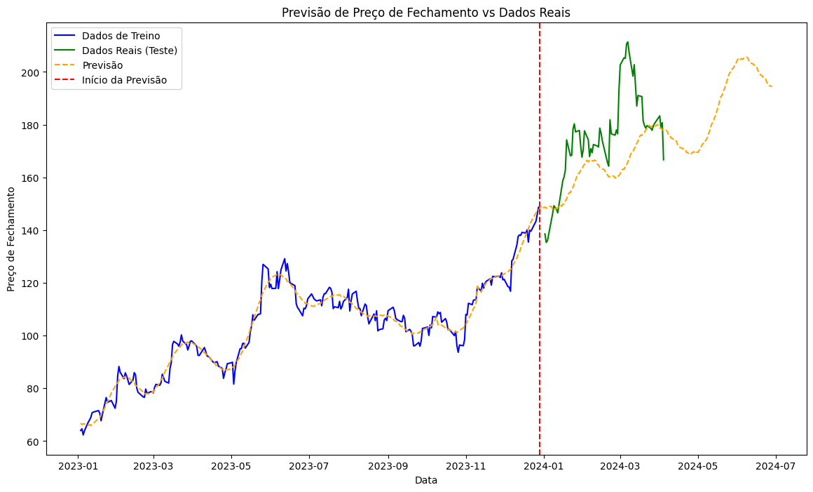
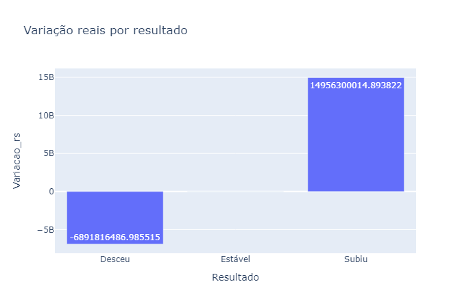

# Imersão Python: Do Excel à Análise de Dados

&logo=python&logoColor=ffffff) &logo=pandas&logoColor=ffffff) &logo=plotly&logoColor=ffffff) &logo=jupyter&logoColor=ffffff) &logo=git&logoColor=ffffff)  &logo=visualstudiocode&logoColor=ffffff) &logo=microsoftexcel&logoColor=ffffff)

Este projeto enfatiza a análise de dados e a geração de gráficos das ações financeiras obtidas da Yahoo! Finance utilizando Python. Os conceitos foram aprendidos na plataforma [Alura](https://www.alura.com.br/).


### Características do Projeto:
- **Programação letrada**: O projeto utiliza a abordagem de programação letrada para tornar o código mais legível e compreensível.
- **Análise de dados financeiros**: O projeto envolve a análise de dados financeiros para extrair insights valiosos.
- **Análise com série temporal**: O projeto realiza análises de séries temporais para identificar tendências e padrões nos dados ao longo do tempo.
- **Curva de tendência de crescimento logístico**: O projeto utiliza a curva de tendência de crescimento logístico para prever o crescimento futuro.
- **Geração de gráficos dinâmicos**: O projeto gera gráficos dinâmicos para visualizar os dados de maneira interativa.
- **Inteligência Artificial**: O projeto empregou o Microsoft Copilot para adquirir informações sobre os segmentos de mercado e a idade das empresas em determinado setor, a partir de uma lista específica de empresas.

# Visualização



|  |  |
|:---:|:---:|

# Instalando e Executando

1. Clone o código fonte:
```git
git clone https://github.com/JoaoSouzaXMP/Imersao-Python-Analise-Dados.git
```

2. Crie um ambiente virtual para o projeto :
```
python -m venv venv
```

3. Ative o ambiente virtual:
```
.\venv\Scripts\Activate.ps1
```

4. Instale todos as dependências:
```
python -m pip install pandas
```
```
python -m pip install plotly
```
```
python -m pip install openpyxl
```
```
python -m pip install nbformat
```
```
python -m pip install mplfinance
```
```
python -m pip install yfinance
```
```
python -m pip install prophet
```